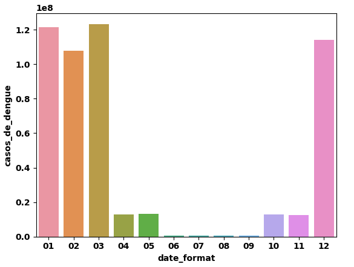

# Dengue Cases Prediction 

---

# 1. Business Problem

A dengue é uma doença viral transmitida principalmente pelo mosquito Aedes aegypti e representa um desafio significativo para a saúde pública devido à sua rápida disseminação e impacto na população. Segundo registros históricos, a dengue afeta o Brasil fortemente desde o início do século XX, embora há registros que os primeiros casos tenham sido ainda no período colonial.

Por isso, o trabalho do cientista de dados, nesse sentido, é auxiliar as autoridades de saúde a tomar medidas preventivas e de controle de forma mais eficaz, direcionando melhor os recursos e intervenções necessárias.

Este trabalho foi realizado em uma competição de dados, o Hackday. Portanto, abaixo você pode acompanhar como o grupo BugOff solucionou o problema proposto: criar um modelo de regressão informando a previsão da quantidade de casos de dengue para os próximos 1500 dias. A métrica que baseou os resultados para rankeamento desta competição é o RMSE. 

# 2. Business Assumption

Para este projeto, os dados foram obtidos de acordo com um banco de dados. Após acesso a este banco, foram encontradas 6 tabelas, que o grupo as uniu pela coluna Date. Assim, as variáveis/atributos originais (e seus significados) do conjunto de dados são:

| Nome da Variável                        | Descrição                                        |
|----------------------------------------|--------------------------------------------------|
| Date                                   | Data das informações                              |
| Presença de Criadouros                 | Porcentagem da área com presença de mosquitos   |
| Falta de Coleta de Lixo                | Taxa de coleta de lixo realizada                 |
| Água Parada em Terrenos Baldios        | Porcentagem da área com presença de água parada  |
| Presença de Piscinas sem Manutenção    | Número de piscinas sem manutenção observadas      |
| Área com Acúmulo de Entulho            | Porcentagem da área com entulho                  |
| Conscientização da População           | Nível de conscientização sobre a dengue          |
| Condições de Moradia Precárias         | Taxa de moradias precárias na área observada      |
| Falta de Acesso a Serviços de Saúde    | Taxa de moradores sem acesso a serviços de saúde |
| Migração de Pessoas de Áreas Endêmicas | Taxa de migração entre áreas                     |
| Transporte de Mercadorias em Áreas Urbanas | Porcentagem de veículos de transporte de cargas |
| Falta de Controle de Pragas            | Porcentagem da área observada sem controle de pragas |
| Presença de Recipientes sem Tampas     | Número de recipientes observados no dia          |
| Precipitação                           | Água proveniente do vapor de água atmosférica depositada na superfície |
| Taxa de Tratamento de Esgoto           | Porcentagem de esgoto não tratado na área observada |
| Umidade                                | Relação entre a pressão parcial da água contida no ar e a pressão de vapor da água à temperatura do ar |
| Temperatura                            | Calor da atmosfera, medido em graus Celsius (ºC) |
| Presença de mosquito                   | Quantidade de mosquitos observada                |
| Casos de dengue                        | Total de número de casos observados no dia       |

# 3. Solution Strategy 

- O modelo será construído em Python.
- Metodologia cíclica CRISP, dividido em 10 ações: 

1. Compreender o Problema de Negócio
2. Coletar os dados
3. Limpar os Dados
4. Realizar Análise Exploratória dos Dados
5. Preparação dos Dados.
6. Selecionar as variáveis mais relevantes
7. Treinar algoritmos de Machine Learning
8. Avaliar a performance desses algoritmos
9. Gerar o arquivo de resultado
10. Propor a solução final

- A qualidade do modelo será baseada na métrica RMSE, calculado pela seguinte equação:

- O resultado será apresentado em arquivo CSV 

# 4. Top Insights 

Durante a análise exploratória de dados, foram gerados insights, através da validação das hipóteses. Insights são informações novas, ou que contrapõem crenças que o time de negócios, ou neste caso, a opinião pública, têm em mente. 

### H1. Meses do verão devem ter mais casos.

**VERDADEIRA**. Meses do verão realmente tem mais casos.

- Aproximadamente 90% dos casos foram registrados nos meses de Janeiro, Fevereiro, Março e Dezembro:

- Vacinas e prevenção devem ser feitas antes desse período;
- Os recursos de atendimento nos hospitais e leitos devem ser preparados para receber um aumento de pessoas.
- Existirá um aumento nos custos hospitalares e locais de atendimento.
- Nesses meses, as campanhas de combate ao mosquito devem ser intensificadas e os cuidados com locais que se acumulam águas devem ser ampliados.

### H2. Quanto maior a conscientização da população deve ter menos casos.

**FALSA**. Em qualquer nível de conscientização, a média de casos registrados é muito próxima.

- Campanhas não estão atingindo o público correto ou de forma clara;
- As campanhas estão sendo feitas de forma tardia ou apenas nos meses com mais casos, impedindo a criação de uma cultura na atitude das pessoas que realmente impeça criadouros de mosquitos.
- Mesmo que a população esteja consciente em relação às medidas de combate ao mosquito, pode ser que os desafios na implementação dos cuidados sejam maiores.

### H3. Menor presença de mosquitos deve resultar em menos chances de casos.

**VERDADEIRA**. Os dados mostram que quanto menor a presença de mosquitos, menos casos são registrados

- Impedir a criação do mosquito ainda pode ser considerado uma forma de evitar a doença.
- Locais abandonados devem ter um tratamento diferenciado para que o trabalho de prevenção não seja prejudicado por estes locais.
- Para a diminuição dos mosquitos transmissores, podem ser tomadas medidas como maior uso de repelentes, inseticidas, telas de proteção, tentar eliminar o máximo de criadouros de água, entre outros cuidados.

### H4. Dias menos úmidos devem ter menos casos

**VERDADEIRA**. Menos de 1% dos casos ocorre quando a umidade está abaixo de 50% e mais de 82% dos casos ocorrem quando a umidade está acima de 65%

- A umidade mais alta facilita criadouro de mosquitos e dificulta a evaporação de água parada.
- Nos dias mais úmidos, o cuidado deve ser intensificado.

# 5. Machine Learning Model Applied 

Após a preparação dos dados, foram treinados 5 modelos de Aprendizado de Máquina com objetivo de encontrar o melhor algoritmo que descreva e explique o problema proposto. Antes disso, também foi verificado o Baseline Model, que é a situação esperada sem a utilização de Machine Learning, baseada na média histórica de casos. 

- CatBoost Regressor
- Random Forest
- LGBM Regressor
- XGBoost Regressor
- Modelo Baseline 

### Avaliação pelo RMSE com Cross-Validation

O RMSE (Root Mean Squared Error) é uma métrica de avaliação de desempenho em modelos de regressão, calculando a raiz quadrada da média dos quadrados das diferenças entre os valores previstos e os valores observados. Ele serve para quantificar o quão bem um modelo de regressão está performando em relação aos dados reais, fornecendo uma medida de dispersão dos erros de previsão.

Cross-Validation é uma técnica usada para avaliar o desempenho de um modelo de aprendizado de máquina. Assim, o algoritmo é destado em diferentes partições (dados de validação) dos dados de treino, para garantir que o modelo seja robusto e generalize bem para novos dados.

Desta forma, foi escolhido para o modelo final o XGBoost Regressor, pois apresentou melhor desempenho para o nosso problema. Em seguida, finalmente obtemos o arquivo com as predições e foi possível submetê-la na plataforma da competição Kaggle para cálculo do RMSE nos dados de produção. Os dados foram enviados em arquivo .csv e abaixo você confere uma representação em Excel dos primeiros 10 dias da predição. 

# 6. Business Result

Quantidade Total de casos Baseline = 67216214
Quantidade Total de casos Modelo XGBoost = 58396191

De acordo com o modelo, 8.820.023 de casos serão previstos a menos que o esperado pelo modelo baseline. 

### Premissas
**1** O governo federal investe em média R$ 1,5 bilhão por ano no combate a dengue. (Ministério da Saúde, 2024)

**2** Cada brasileiro contaminado com dengue custa, em média, R$ 100,00.

### Alocação de Verba para outros setores de Saúde

- 100,00*8820023 = R$ 882.002.300 ao longo dos 1500 dias.

- Alocação de Recursos: 214,6 milhões de reais por ano

# 7. Conclusions

Os resultados mostram que o objetivo do projeto foi alcançado e, portanto, as autoridades sanitárias poderão ter mais condições para tratar desse grande problema de saúde pública, baseada em muitos fatores.

O verão marca um aumento significativo nos casos de dengue, exigindo antecipação de vacinas, preparação de recursos hospitalares e intensificação das campanhas de conscientização. A consistência na média de casos independentemente do nível de conscientização sugere falhas na abordagem das campanhas. 
 
Além disso, a redução da presença de mosquitos é crucial para diminuir os casos, destacando a importância de medidas preventivas em locais abandonados. Umidade alta também está correlacionada a mais casos, exigindo uma atenção especial nos dias mais úmidos. Em suma, a prevenção precoce, campanhas eficazes e controle do mosquito são fundamentais para reduzir a incidência de dengue e seus custos associados.

# 8. Lessons Learned e Next Steps 

Em projetos seguintes, além do que já foi feito, podem ser incrementados:

- Trabalhar com uma gama maior de parâmetros e de algoritmos.
- Analisar a viabilidade de obter dados sobre geolocalização
- Analisar a viabilidade de obter dados da faixa etária dos contaminados

# 9. References

- O enunciado do projeto e os datasets estão em: [Kaggle](https://www.kaggle.com/competitions/8-hackday-comunidadeds/overview)
- A imagem de capa: [Pixabay](https://pixabay.com/pt/illustrations/mosquito-inseto-mal%C3%A1ria-dengue-8572922/)
- Imagem CRISP: [Arte dos Dados](https://artedosdados.blogspot.com/2013/12/mineracao-de-dados-e-o-crisp-dm-data.html)